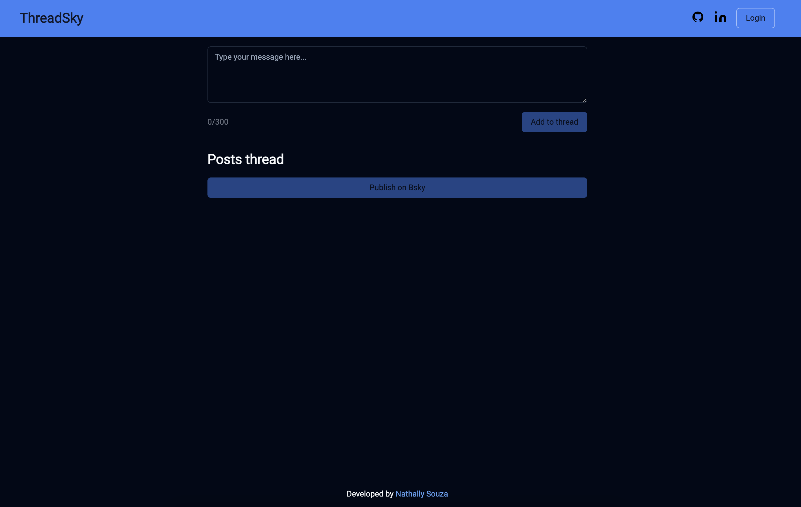

# Bskytools

This repository contains a collection of tools designed to assist in creating threads on Bsky.



## Installation

```bash
$ npm install
```

## Running the app

```bash
# watch mode
$ npm run dev
```

## Test

```bash
# unit tests
$ nom run test
```

## Stay in touch

- Author - [Nathally Souza](https://linkedin.com/in/nathsouza)

## License

Nest is [MIT licensed](LICENSE).
